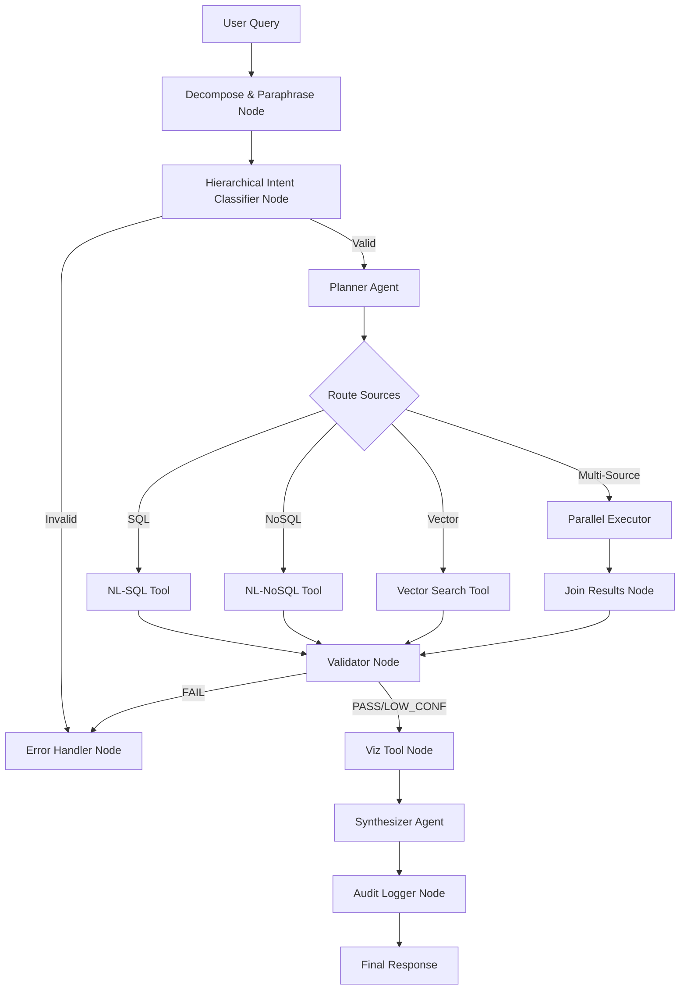

# DRISHTI - Chat and Interact with Database

DRISHTI is an enterprise-grade agentic AI system for RBI banking supervision. It allows supervisors to query across structured data (PostgreSQL), semi-structured event logs (MongoDB), and unstructured policy circulars/inspection reports (Vector DB) using natural language. This blueprint maps the full implementation of the 13-component agentic pipeline using **LangGraph**, **FastAPI**, and a **premium Glassmorphism HTML/JS UI**.

---

## User Review Required

> [!IMPORTANT]
> - **Gemini API Key**: We will use the Google GenAI library (`google-generativeai`) configured with `Gemini 3.5 Flash` (or similar) to handle classification, decomposition, planning, SQL/NoSQL generation, and final synthesis.
> - **Database fallback system**: To ensure immediate runnability out-of-the-box (even without pre-installed local PostgreSQL, MongoDB, or Redis instances), the application includes automatic fallback utilities to **SQLite** (for SQL), **TinyDB/JSON** (for NoSQL), **Chroma DB** (for Vector DB), and **In-Memory dicts** (for Redis).
> - **SpaCy Model**: We will use SpaCy's `en_core_web_sm` model for quick local entity extraction.

---

## Proposed Changes

We will organize the codebase in the `c:/Users/admin/OneDrive/Documents/DRISHTI` folder.

### 1. Database & Seeding Layer

#### [NEW] [seed_all.py](file:///c:/Users/admin/OneDrive/Documents/DRISHTI/db/seed_all.py)
A master seeding script that will:
1. Parse SQL DDL from `SQL_Tables_Creation.txt` and seed sample data from `SQL Table data insertion.md` into PostgreSQL (and fallback SQLite database `drishti_fallback.db`). It will also compile the materialized views (`v_bank_risk_summary`, `v_fraud_delay_violations`, `v_uncomplied_penalties`).
2. Parse NoSQL JSON documents from `NoSQL Collection Data Insertion.md` and seed into MongoDB (and fallback JSON database `nosql_fallback.json`).
3. Parse VectorDB document structure from `VectorDB_Creation.txt`, generate synthetic text content for the 43 documents, chunk them, embed them (using sentence-transformers or Gemini API), and insert into Chroma DB.

---

### 2. Core Library & Configuration

#### [NEW] [config.py](file:///c:/Users/admin/OneDrive/Documents/DRISHTI/drishti/config.py)
Main configuration file managing connection strings, LLM parameters, paths for local databases, and department permissions logic.

#### [NEW] [db_connections.py](file:///c:/Users/admin/OneDrive/Documents/DRISHTI/drishti/utils/db_connections.py)
Database helper classes wrapper checking connection status for PostgreSQL, MongoDB, Redis, and Vector DB, falling back seamlessly if any service is down.

#### [NEW] [llm.py](file:///c:/Users/admin/OneDrive/Documents/DRISHTI/drishti/utils/llm.py)
Utility to call the Gemini API using structured JSON output schemas to enforce strict data contracts for classifiers, SQL generation, planner, and validator nodes.

#### [NEW] [cache.py](file:///c:/Users/admin/OneDrive/Documents/DRISHTI/drishti/utils/cache.py)
Implements tiered TTL caching (Redis or in-memory) for query results, intent routing, and execution plans to optimize latency.

---

### 3. State & LangGraph Engine

#### [NEW] [state.py](file:///c:/Users/admin/OneDrive/Documents/DRISHTI/drishti/state.py)
Defines the `RBIState` using `TypedDict` containing all execution context (query, decomposition, plans, tool results, validation, charts, response, and audit log).

#### [NEW] [graph.py](file:///c:/Users/admin/OneDrive/Documents/DRISHTI/drishti/graph.py)
Wires the LangGraph node functions and conditional edges together, compiling it into an executable graph.

#### [NEW] [nodes/](file:///c:/Users/admin/OneDrive/Documents/DRISHTI/drishti/nodes/)
- **[decomposition.py](file:///c:/Users/admin/OneDrive/Documents/DRISHTI/drishti/nodes/decomposition.py)**: Performs SpaCy-based NER and dependency parsing, and flan-t5-small/Gemini-based query paraphrasing in parallel. Run before classification.
- **[hierarchical_classifier.py](file:///c:/Users/admin/OneDrive/Documents/DRISHTI/drishti/nodes/hierarchical_classifier.py)**: Combines L1 and L2 checks into a single step:
  - *Level 1 check*: Regex sanitization (SQL Injection/XSS), structural length/char check, and domain keyword scanner using SpaCy extracted tokens.
  - *Level 2 check*: Signal-based query router and LLM fallback to resolve intent routing to sources (SQL, NoSQL, Vector) and query type.
- **[planner.py](file:///c:/Users/admin/OneDrive/Documents/DRISHTI/drishti/nodes/planner.py)**: Checks plan cache for known query signatures, otherwise compiles a DAG of tool nodes with parallel execution hints.
- **[executor.py](file:///c:/Users/admin/OneDrive/Documents/DRISHTI/drishti/nodes/executor.py)**: Core execution loop running tool calls in parallel using `asyncio.gather` and handles in-memory joins.
- **[validator.py](file:///c:/Users/admin/OneDrive/Documents/DRISHTI/drishti/nodes/validator.py)**: Performs rule-based validations (PII scans, amount limits, date validations) and calls an LLM validator for anomalies.
- **[synthesizer.py](file:///c:/Users/admin/OneDrive/Documents/DRISHTI/drishti/nodes/synthesizer.py)**: Blends tool data with cited sources and outputs streaming responses.
- **[audit.py](file:///c:/Users/admin/OneDrive/Documents/DRISHTI/drishti/nodes/audit.py)**: Asynchronously logs full context (PII masked, query, latency, sources) to an append-only JSON file/database.

---

### 4. Interactive Interface & Backend Server

#### [NEW] [api.py](file:///c:/Users/admin/OneDrive/Documents/DRISHTI/drishti/api.py)
FastAPI app exposing endpoints for:
- Query execution (SSE streaming to stream tokens)
- Seeding status and DB dashboard
- Audit log logs viewer
- Sample query list

#### [NEW] [app.py](file:///c:/Users/admin/OneDrive/Documents/DRISHTI/app.py)
Entry point starting FastAPI server and mounting static dashboard files.

#### [NEW] [index.html](file:///c:/Users/admin/OneDrive/Documents/DRISHTI/static/index.html) & [index.css](file:///c:/Users/admin/OneDrive/Documents/DRISHTI/static/index.css) & [main.js](file:///c:/Users/admin/OneDrive/Documents/DRISHTI/static/main.js)
Premium Glassmorphism Dashboard UI:
- **Chat Interface**: Streamed responses with detailed citations and confidence tags.
- **Data & Charts Panel**: Live Chart.js graphs rendered automatically from visualization specs.
- **Execution Trace Viewer**: Visual step-by-step trace showing active nodes, individual latencies, and SQL/NoSQL query logs.
- **DB Operations Hub**: Monitor seed status, select user department (DEPT_RISK, DEPT_FRAUD, DEPT_FINTECH, DEPT_EXEC), and run test suite.

---

## Verification Plan

### Automated Tests
- **[test_harness.py](file:///c:/Users/admin/OneDrive/Documents/DRISHTI/tests/test_harness.py)**: Runs the 50 queries across departments, verifying:
  1. Success rate of L1 and L2 classification.
  2. SQL/NoSQL query accuracy and successful validation pass rates.
  3. Latency benchmarks (target under 1000ms for parallel calls).

### Manual Verification
- We will start the FastAPI dashboard web app and verify the visual styling, stream generation, interactive charts, and audit logs inside the web browser.
